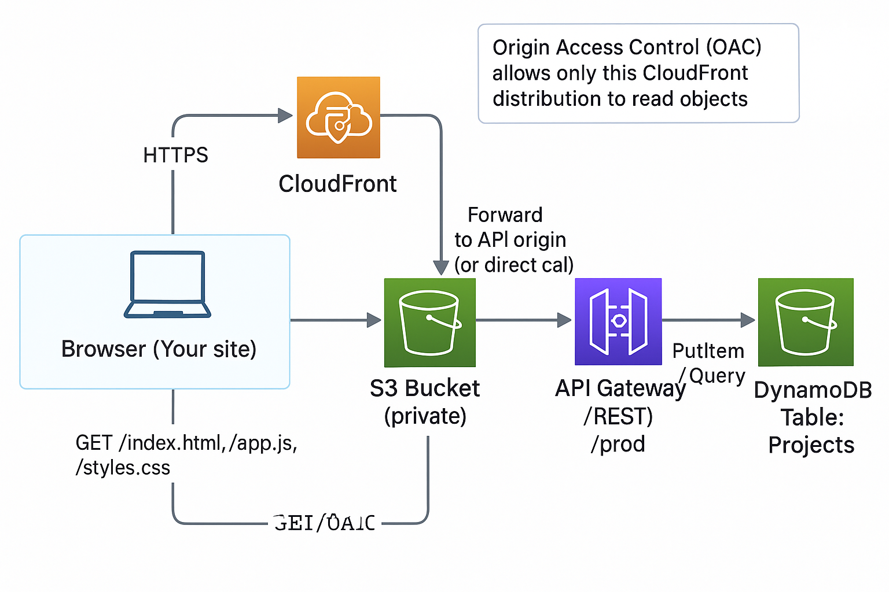
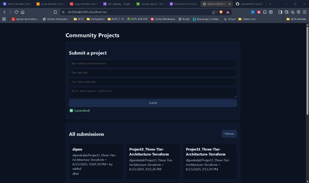

# Community Projects — AWS Serverless GitHub Submissions

A tiny serverless app where anyone can **submit a GitHub repo** and **browse all submissions**.  
Frontend runs on **S3 → CloudFront (OAC, HTTPS)**; API is **API Gateway (REST) → Lambda (Python) → DynamoDB**.

> Was Live at: https://d2c28v2xk2s98n.cloudfront.net  
> API base: `https://o4hzlr5rqd.execute-api.us-east-2.amazonaws.com/prod`

---

## Features

- Submit a GitHub repository URL (validated `https://github.com/<owner>/<repo>`) + optional title/description/name
- “All submissions” list with **cursor-based pagination**
- Private S3 bucket via **CloudFront Origin Access Control (OAC)**
- CORS locked to your CloudFront origin (or proxy API via CloudFront `/api/*` to avoid CORS entirely)

---

## Stack

- **CloudFront + S3** — static hosting (private bucket, HTTPS)
- **API Gateway (REST)** — `/projects` (**GET**, **POST**, **OPTIONS**)
- **AWS Lambda (Python)** — request handling, validation, CORS
- **DynamoDB** — submissions store  
  - Partition key: `Project` (String, constant `"PROJECT"`)  
  - Sort key: `{createdAtEpochSeconds}#{uuid}` (String) — newest-first queries

---

## Flow

## Test Commands

### POST (create)
curl -i -X POST \
  -H "Origin: https://d2c28v2xk2s98n.cloudfront.net" \
  -H "Content-Type: application/json" \
  -d '{"repo_url":"https://github.com/owner/repo","title":"Demo"}' \
  "https://o4hzlr5rqd.execute-api.us-east-2.amazonaws.com/prod/projects"

### GET (list)
curl -i -H "Origin: https://d2c28v2xk2s98n.cloudfront.net" \
  "https://o4hzlr5rqd.execute-api.us-east-2.amazonaws.com/prod/projects?limit=12"

## Ouput

